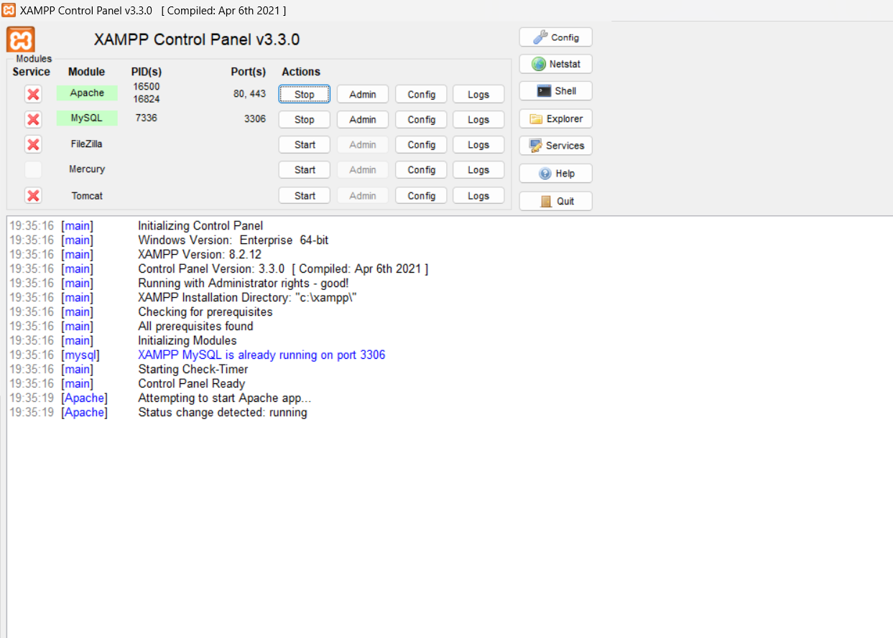
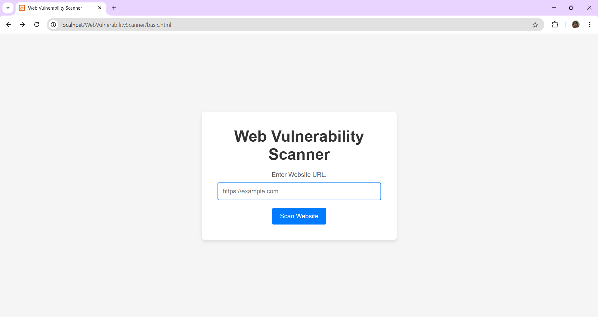
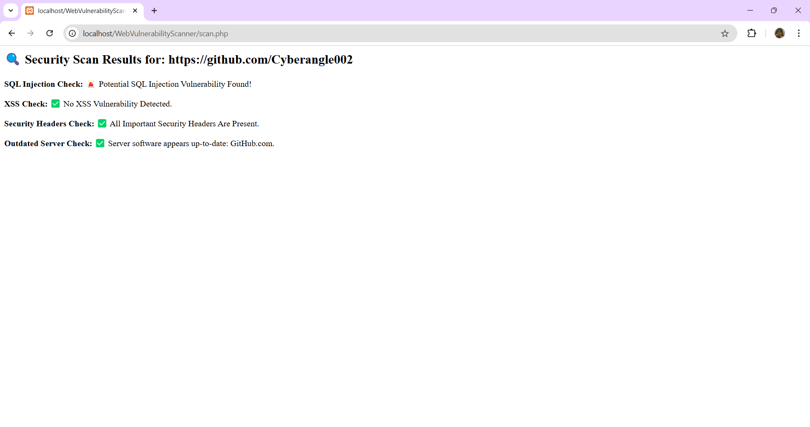

# Web Vulnerability Scanner

This is a simple web vulnerability scanner built to help identify potential security vulnerabilities on websites. Users can input a website URL, and the scanner will perform an analysis to detect common vulnerabilities.

## Features
- **Website Scanning**: Enter any website URL to initiate the scan.
- **Simple Interface**: The scanner provides an easy-to-use web interface for URL input.
- **Security Focus**: Designed to help website owners or security professionals identify vulnerabilities.


## Technologies Used
- **HTML**: Markup language used for the structure of the page.
- **CSS**: Used for styling the page and making it responsive.
- **PHP**: Backend server script (`scan.php`) to handle the scanning process (Note: This needs to be implemented for actual functionality).

## Installation

To run this project locally, follow these steps:

1. Clone the repository:
   ```bash
   git clone https://github.com/your-username/Web-Vulnerability-Scanner.git

2.Navigate into the project folder:
         cd Web-Vulnerability-Scanner
         Since this project involves PHP for backend scanning, you will need a local server like XAMPP, MAMP, or WAMP to run the PHP script.

3.If you don't have a server environment set up, download and install one of the following:
XAMPP for Windows, macOS, or Linux.
MAMP for macOS or Windows.
WAMP for Windows.

4.Place the Project in the Server's Root Directory:
For XAMPP, copy the entire project folder into htdocs directory (C:\xampp\htdocs on Windows or /Applications/XAMPP/htdocs on macOS).
For MAMP, copy the folder into htdocs (/Applications/MAMP/htdocs).
For WAMP, copy the folder into www (C:\wamp64\www).

5.Open the local server environment (e.g., XAMPP or MAMP) and start the Apache server (and MySQL, if needed). This will allow PHP to run locally.

6.Open Your Browser:
In your browser, go to http://localhost/Web-Vulnerability-Scanner (replace Web-Vulnerability-Scanner with the folder name you used if different).
You should now be able to see the front-end of the project, where you can input the website URL to scan.

7.Test the Scanner:
Enter a website URL in the input field and press Scan Website to see the result (Note: The scan functionality is currently a placeholder and requires backend implementation for full functionality).


Notes:
For a more advanced scanning feature, you will need to implement the backend PHP script in scan.php to perform actual vulnerability checks.
If you're using a different server setup (e.g., Apache), make sure PHP is configured properly on your local environment.

This guide explains how to set up your local development environment, where to place your files, and how to run the project locally using a PHP server like XAMPP or MAMP. If you're only using HTML and CSS for the front end, you can skip the PHP server steps and open the `index.html` directly in the browser.






